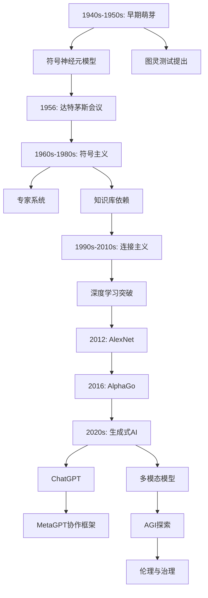
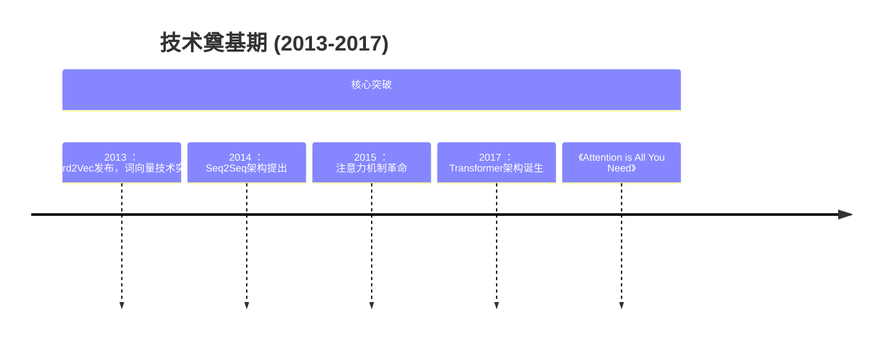
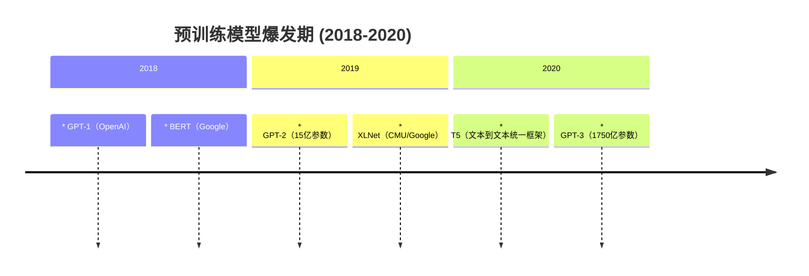
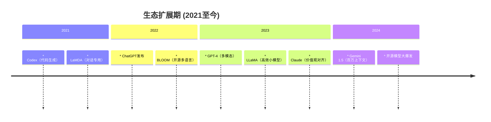
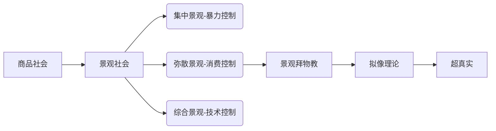

---
{"dg-publish":true,"permalink":"/Notion/大语言模型课（初级班）/Day1 大语言模型先导课/Day1 大语言模型先导课/","noteIcon":""}
---

# 大模型发展历史简述

## AI发展史

AI简易发展史

  

  

- 1943年McCulloch和Pitts提出==人工神经元模型==，==图灵提出“图灵机”和“图灵测试”为AI的逻辑基础==

> 图灵测试（英语：Turing test）是英国计算机科学家艾伦·图灵于1950年提出的思想实验，图灵亦将其称为“模仿游戏”（imitation game），这个实验的流程是由一位询问者写下自己的问题，随后将问题发送给在另一个房间中的一个人与一台机器，由询问者根据他们所作的回答来判断哪一个是真人，哪一个是机器，所有测试者都会被单独分开，对话以纯文本形式透过屏幕传输，因此结果不取决于机器的语音能力，这个测试意在探求机器能否模仿出与人类相同或无法区分的智能。

- ==1956年==达特茅斯会议首次提出==“人工智能”==概念，标志学科正式诞生
- 1966年：首款聊天机器人ELIZA问世
- 符号主义Symbolic AI

> Symbolic AI 是一种传统的人工智能方法，其核心思想是基于符号表示和符号推理。这种方法试图模拟人类推理的过程，通过使用符号来表示知识和推理规则，以便计算机可以执行复杂的智能任务。==在 Symbolic AI 中，知识以符号形式硬编码在系统中==，而机器学习方法则通过学习从数据中提取模式来获取知识。

- 专家系统时代（1980-1987），专家系统（如MYCIN医疗诊断系统）商业化成功

  

  

  

- 1986年：反向传播算法优化神经网络训练
- 1997年：IBM深蓝击败国际象棋世界冠军
- 2006年：杰弗里·辛顿提出==“深度学习（Deep Learning)”==概念，开启新时代

> **深度学习**（英语：deep learning）是机器学习的分支，是一种以人工神经网络为架构，对资料进行表征学习的算法。 深度学习中的形容词“深度”是指在网络中使用多层

- AlexNet在ImageNet竞赛夺冠，CNN崛起

> **卷积神经网络**（英语：convolutional neural network，缩写：**CNN**）是一种前馈神经网络，它的人工神经元可以响应一部分覆盖范围内的周围单元，对于大型图像处理有出色表现。

- 2016年：==AlphaGo==击败李世石，强化学习突破。

  

  

- ==2020年后：大语言模型（LLM）爆发（如GPT系列、Transformer架构）。==

  

  

  

  

  

## 大语言模型发展

  

  

**技术奠基期（2013-2017）**

- **2013**：==Word2Vec==诞生（Mikolov），词向量技术突破

> word2vec来源于2013年的论文《[Efficient Estimation of Word Representation in Vector Space](https://arxiv.org/pdf/1301.3781)》，它的核心思想是通过词的上下文得到词的向量化表示

- **2014**：Seq2Seq架构提出（Sutskever），解决序列转换问题
- **2015**：==注意力机制革命==（Bahdanau）
- **2017**：==Transformer==架构发布（Google 《==[Attention is All You Need](https://arxiv.org/abs/1706.03762)====》）==

  

  

  

- **2018**：
    - ==GPT-1（OpenAI）：首个生成式预训练模型（1.17亿参数）==
    - BERT（Google）：双向Transformer（3.4亿参数）
- **2019**：
    - GPT-2（OpenAI）：文本生成能力突破（15亿参数）
    - XLNet（CMU/Google）：超越BERT的预训练模型
- **2020**：
    - T5（Google）：文本到文本统一框架（110亿参数）
    - GPT-3（OpenAI）：少样本学习震惊业界（1750亿参数）

  

- **2021**：
    - Codex（OpenAI）：代码生成模型（GitHub Copilot基础）
    - LaMDA（Google）：对话专用模型
- **2022**：
    - ==ChatGPT（OpenAI）：基于GPT-3.5的对话革命==
    - BLOOM（BigScience）：最大开源多语言模型（1760亿参数）
- **2023**：
    - GPT-4（OpenAI）：多模态能力突破
    - LLaMA（Meta）：高效小规模模型（70亿-650亿参数）
    - ==Claude（Anthropic）：对齐人类价值观的AI助手==
- **2024**：
    - Gemini 1.5（Google）：百万级上下文窗口
    - 开源模型爆发（Mistral、Qwen、DeepSeek等）

> [!important] AI的热度已经过去了？不，一切才刚刚开始。

# 主流大模型介绍

> [!important] Attention：==对话产品只是基于模型公司的大模型的一个副产品==，而已。在模型外面套壳以便进行对话是很容易的事（正如很多国内”ai公司“干的事一样）。模型公司最大的资产是其模型。不要再把眼光只关注到对话这一方面，认为大语言模型就是个chatbot  Unfortunately, 以下国外的大模型均需要以正确上网姿势才能访问。没有机会直接体验还是蛮遗憾的。拥有一个稳定、安全的网络环境无比重要。 

  

**热知识1：模型后面跟着多少多少B，是啥意思？**

大语言模型名称中的“B”代表“==Billion==”（十亿），表示模型的可训练参数数量。例如，GPT-3 175B表示该模型包含1750亿个参数，LLaMA-7B表示70亿参数。参数量越大，通常模型的复杂度和表达能力越强，但也需要更高的计算资源和训练数据支持。==决定模型能力最重要的两个因素：参数量和训练数据量==（模型参数量与训练数据量需保持平衡以避免过拟合或欠拟合）

|**模型名称**|**参数量（B）**|**训练数据量（Token）**|**数据来源**|
|---|---|---|---|
|**GPT-3**|175|4990亿|网页、书籍、维基百科等|
|**GPT-4o**|1800|~13T，训练成本约7,800万美元||
|**BERT-base**|0.11|33亿|英文维基百科、书籍|
|**PanGu**|100-1000|3万亿|中文多领域语料|
|**ERNIE Bot**|260|2600亿|中文百科、新闻、代码|
|**DeepSeek-R1满血版**|**671**|~500B，训练成本约560万美元||
|**Claude-3-Opus**|未公开|~3T||

  

**热知识2：我们看到的7B 32B模型是怎么回事？**

==蒸馏（Distillation）==在机器学习中是一种通过知识迁移实现模型优化的技术，其核心是将复杂模型（教师模型）中蕴含的隐含知识转移到简单模型（学生模型）中，以提升后者性能或降低其复杂度。

  

|**国家**|**公司**|**对话产品**|**旗舰大模型**|**网址**|
|---|---|---|---|---|
|美国|OpenAI|ChatGPT|GPT|[https://chatgpt.com/](https://chatgpt.com/)|
|美国|Microsoft|Copilot|GPT 和未知|[https://copilot.microsoft.com/](https://copilot.microsoft.com/)|
|美国|Google|Gemini|Gemini|[https://gemini.google.com/](https://gemini.google.com/)|
|美国|Anthropic|Claude|Claude|[https://claude.ai/](https://claude.ai/) ，公认不输甚至超过 GPT 的   该公司由前 OpenAI 研究副总裁==Dario Amodei==与妹妹 Daniela Amodei 等团队成员因对 AI 安全发展方向的分歧，离开 OpenAI 后创立。   Dario Amodei的担忧：   认为模型规模的指数级增长（如参数量激增）可能导致不可预测的风险，例如AI系统绕过人类控制或产生欺骗性行为|
|中国|百度|文心一言|文心|[https://yiyan.baidu.com/](https://yiyan.baidu.com/)|
|中国|阿里云|通义千问|通义千问|[https://tongyi.aliyun.com/qianwen](https://tongyi.aliyun.com/qianwen)|
|中国|智谱 AI|智谱清言|GLM|[https://chatglm.cn/](https://chatglm.cn/)|
|中国|月之暗面|Kimi Chat|Moonshot|[https://kimi.moonshot.cn/](https://kimi.moonshot.cn/)|
|中国|MiniMax|星野|abab|[https://www.xingyeai.com/](https://www.xingyeai.com/)|
|中国|深度探索|deepseek|DeepSeek|[https://chat.deepseek.com/](https://chat.deepseek.com/)|

**《中文大模型基准测评2025年5月报告》**

  

  

# 大模型基本概念简述

## 大语言模型基本概念

### 基本概念

  

  

  

  

  

  

  

  

  

  

❌ 大模型不是大型数据库，将世界上所有出现过的问题都存进去。

❌ 大模型不是搜索引擎，联网搜索只是近期嵌入大模型的一个功能。它贵就贵在前期投入了海量算力调出来的模型上。把大模型只当搜索引擎用，杀鸡焉用牛刀？

❌ 大模型并不真正理解自然语言，对它而言一切都是向量，是数字，当然也并不真正理解它生成的内容，一切都是概率。（当然，哲学层面上来讲，谁又能断定上帝不掷色子呢。谁又能预测，更海量的数据这么训练下去，大模型会不会出现意识涌现的奇点呢😈，此类担忧正是前 OpenAI 研究副总裁==Dario Amodei 从OpenAI公司离职，创办==Anthropic公司的原因）

  

- 我们总说的AI，囊括了非常多的方面。这也是为什么我不轻易用AI这个词，我们的课程名写的是大模型课程的原因。
- AGI （Artificial **General** Intelligence 通用人工智能）： 具备与人类相近的全面智能水平的人工智能系统。与现有的**窄人工智能（Narrow AI）**（如语音助手、图像识别系统等）不同，AGI能够广泛应用于各种任务和领域，具备自主学习、推理、适应和解决复杂问题的能力。==目前，AGI尚未实现。==
- 现有的AI系统（如ChatGPT、AlphaGo等）都属于**窄人工智能**，即只能执行特定任务或领域的工作。AGI的开发仍然是人工智能领域的终极目标之一，但也面临巨大的技术、伦理和哲学挑战。
- AIGC（Artificial Intelligence **Generated** Content 人工智能生成内容）
- GPT（ Generative ==Pre-trained Transformer== 生成式预训练转换器）：生成式预训练转换器（GPT）是一种基于Transformer模型的大型语言模型，能够在大规模未标记文本数据集上进行预训练，并生成类似于人类自然语言的文本

  

  

  

  

  

  

  
✅基于海量训练数据的语言统计中，大模型涌现出了其**逻辑性**，掌握了某些特定的因果关系。

✅大语言模型的指令模型 Instruct Model VS 推理模型 Reasoning Model :

通用模型(指令模型)，被设计用于遵循指令去生成内容的或执行任务的。类似模型有：OpenAI的GPT 4o，DeepSeek V3，豆包

推理模型，专注于逻辑推理和问题解决的模型，擅长数学推理、因果推断、复杂决策、编程等。类似模型有：OpenAI GPT o1，DeepSeek R1

✅训练的文本对大模型使用的表现有直接关系，这就是为什么ChatGPT对汉语提示词的直观感受效果不如英语，而DeepSeek对汉语提示词的生成效果更佳的原因。

  

  

### 神奇的逻辑涌现与思维链

- 大模型通过海量数据训练，学习语言中的隐性逻辑结构。自监督目标推动模型捕捉数据中的因果关联性与推理模式
- **思维链（Chain-of-Thought, CoT）：**一种显式引导大模型分步推理的技术，其核心在于模拟人类认知中的中间推导过程。CoT通过自然语言提示（如“让我们一步步思考”），要求模型生成问题解决的中间步骤

  

### 什么是Token?

**大语言模型的向量是以Token而非字符为对象。**通过「分词」(Tokenization) 将文本切分为**语义单元（Token）**。Token可能是单词/汉字，也可能是单词的一部分，也可能是一个词组或者空格、标点，也可能是图像的一小块区域，声音的一小块片断等。大模型在开训前，需要先训练一个 tokenizer 模型，它会把所有喂给它的文本切成 token。  
同样，大语言模型在生成内容时，也以Token的形式输出，再重新组合成人类可理解的语言。 这也是为什么我们看到大模型输出时都是一个字一个字往外蹦。目前大模型的API调用费用**以Token计费**。

不同大模型的分词器模型不同，故而同样一句话，输入不同的大模型，Token数目并不一样。

  

Try it: [https://platform.openai.com/tokenizer](https://platform.openai.com/tokenizer)

### 训练方式

|**维度**|**预训练(Pre-training)**|**训练（Training）**|**微调(Fine-Tuning)**|
|---|---|---|---|
|**数据**|大规模无标注通用数据|任务标注数据|小规模任务标注数据|
|**目标**|学习语言通用表示|直接优化任务性能|适配特定任务|
|**初始化**|随机初始化|随机初始化|基于预训练参数初始化|
|**计算成本**|极高（周/月级）|高（依赖数据规模）|低（小时/天级）|
|**适用场景**|构建基础模型（如BERT、GPT）|无预训练模型时的小任务|快速部署专业任务|
|**优势**|泛化能力强，知识覆盖面广|任务设计自由|高效利用预训练知识|
|**局限性**|无法直接解决具体任务|需大量标注数据，易过拟合|依赖预训练模型的质量|

## 预训练大模型从0到1的大体流程

- 数据工程
    - 数据获取：书籍，图像，代码，互联网资源，学术论文等
    - 数据清洗：你猜大语言模型会不会有种族歧视？😈
    - 构建分词器：**Tokenization** [https://platform.openai.com/tokenizer](https://platform.openai.com/tokenizer)
- 模型架构设计
    - 目前主流大模型均采用==**Transformer架构**==
    - 参数规模规划（看看兜里有多少钱啊）
- 预训练（Pre-training）
    - 基础设施：万卡GPU集群
    - 训练任务设计：挡上中间某个词让模型猜？还是根据上文预测下文的词？
- 微调（Fine-tuning）
    - 特定数据集
    - 轻量化微调（Parameter Efficient Fine-Tuning, PEFT）：如LoRA（**Low-Rank Adaptation** 低秩适应）：
- 优化
    - 知识蒸馏
    - 任务准确率评估

## 大模型AI体系庞大的知识树

## 大语言模型是如何连接外部世界的

### 基于大语言模型的应用产品架构目前有三种模式

- AI Embedded: 以人为主导，某一个环节某一个任务需要调用AI
- AI Copilot: 每一个任务都有AI的介入（目前最常见）
- AI Agent: 智能体，人直接将任务丢给AI，AI自己拆解任务并执行，返回结果。该模式如果大范围实现，人类将不再作为螺丝钉而存在。只需将需求、想法丢个AI，AI自动做可行性分析、拆解项目、制定项目计划、项目落地与实现。

  

### **大模型为什么需要连接外部世界？**

- 一个大模型的训练过程，当训练完成时，大模型就固定下来了，不会再获取新知识了
- 如果要我比喻的话，它好像一个缸中之恼，可以做一些模拟人脑神经突触的”思考“活动，但它没有存储设备，它没有手脚可以真正地做事情，它需要调用外界的工具去查找资料、发起实际动作（比如发送邮件）、

Emmm……忽然有点共情它了肿么肥死

  

### **大语言模型的应用主要有三种方式：**

- 纯聊天。想各种办法（比如提示词优化 prompt optimization）来想尽办法让大模型理解我想要什么，给出我想要的结果（比如AI绘画时，反向提示词甚至要写清，不要腿部畸形、不要给我多腿儿等，干过这事的都知道光用语言描述，让大模型给出满意的输出不太容易。它还是个宝宝）
    
    
    

  

- **RAG（Retrieval-Augmented Generation）**：的
    
    
    

- **Agent + Function calling**: 人问了大模型一个问题或者给了一个任务，大模型自己由于既有知识不足（如实时性要求较高）、无法独立完成等，会调用外部提供的函数接口，以获取信息或完成任务
    
    
    

  

- **Fine-tuning（精调/微调）**
    
    
    

  

  

# 大模型的场景运用

> [!important] 大模型如天津的大饼，可以卷一切？！

## 助手类

- 数据清洗

[https://www.wenxiaobai.com/share/chat/1a1003bf-ea6c-40cf-8d5e-abc7ce0afd08](https://www.wenxiaobai.com/share/chat/1a1003bf-ea6c-40cf-8d5e-abc7ce0afd08)

- 文档阅读

当你需要在短时间内==**提取大量文本的重点内容**==时，大语言模型绝对是一个非常好用的工具。《景观社会》在我的待读列表中一直没读完（翻译太烂了！），下面是通过给AI喂电子书，制作的思维导图

  

  

> [!important] 这是一个获取知识最容易的时代。任何人都可以用比以前更少的时间、更低的成本来获取知识，只要你真的愿意去touch. 知识不再是稀缺资源，缺乏的是运用知识的头脑，make your hands dirty的行动力，思如泉涌的创造力。 

- 会议纪要

你是否还在为会议中跟不上老板天马行空不走脑子的嘴，回去写会议纪要时一头雾水？多模态大语言模型，audio to text 帮你解决！以下随意尝试了阿里旗下的一个免费小模型FunAudioLLM/CosyVoice2-0.5B

{"text":"啊，其实天不错。😊，咱们这个就是是这样一个故事，就是从这边开始，就是我们认为在亘谷的时间中，在命运的不确定性中，人类开始希望能够说去追求命运的呃确定以及命运的痕迹，人们渴望去把握命运。然后在这样的一个念头的驱使下，一个部落选出了一个婴儿决定让他去用他的毕生追去。去追求属于他的命运。然后从他出生以后，他就接受适合的教育，然后被免除劳役，就是专心他专心读书学习，然后向村里的老人学习他们的智慧。然后同时大人们从小告诉他，你的你的命运就是去追寻你自己的命运。你要去我替我们去追求说到底看看命运是什么样的事物。我们是否能够把握他。然后在他成长的过程中，他的邻居是一个手工匠人，这个手工匠人非常擅长制作黄金的饰品，然后他就跟着这个手工匠人进行学习。因为呃大人们告诉他，只要去追求自己的命运就可以了。所以他被允许做任何他喜欢的事情。然后他着迷于这个黄金饰品的制作中，呃，白天黑夜都不断的就是用锤子和各种工具去制。做这样一个五角星型的一个饰品，然后他的做出来的这些他在这个方面非非常的有天赋。他制作出来的黄金饰品受到大家的欢迎。然后渐渐的他在他迷失了他过往的目标，他开始追求身份和财产上的呃一个忧郁。然后在他这样重复这样的人生几十年以后，在他中年时，有一天他突然做了噩梦。梦中，他的命运就像达摩。克里斯之剑一样悬在他的头顶，然后他发现自己一直以来追求的这些身份和财产，如今成为了他的枷锁，他不再拥有自由，反而是被这些绑定在绑定在人生这条船上。然后这时他在他从梦中醒来后，他感觉梦里的这个达摩克茨西之剑似乎仍然悬在自己的头顶。然后他好像在黑暗中看到这些剑的影子。。对。于是他痛定思痛，重新想起了他的人生被赋予的意义。他回到部落中去重新向老人们学习他学习那些知识和技能。然后他不再去呃，他想通了一个道理。他发现命运不是自己去呃定下一个目标去追逐他，而是说他所做，他所想他所感受到的一切，在指引他走上那条命定的命运之路。于。是他安心的休养生息，不再追求世俗的成就与地位，而是每天每天日出而作，日落而息，呃，学习知识，努力工作。呃，让自己活成一个非常闲适，非常恰好的一个状态。然后在这样的状态下，他渐渐的领悟了到底什么是命运。原来命运确实是不可知不可追，不可行的形态。但是命运的是每一天的。生活当中呃，其实就蕴含着的哲理，只是它太微小了，以至于人们很难去发现它。他发现命运并不是什么怪物，也不是什么珍宝。呃，只要你好好的去过你的人生，做你想做的事情，你好好的度过每一天，这就是你的命运。哇我跟你讲个这个。"}

  

## 拍照答题，哪里不会拍哪里，妈妈再也不用担心我的学习

  

homerwork AI

[https://www.gauthmath.com/](https://www.gauthmath.com/)

[https://www.questionai.com/](https://www.questionai.com/)

[https://www.wenxiaobai.com/](https://www.wenxiaobai.com/) 拍照答疑

  

  

  

## 英语学习，再没借口说没人陪我练口语

  

有道AI

  

多邻国推出的AI虚拟角色Lily，通过生成式技术实现与用户的视频对话功能，主要用于语言学习场景。

## 办公，就是折腾

WPS AI，润色、文档生成PPT、修改、美化，付费用户专属=_,=

  

### **WPS + deepseek , 贫穷使我快乐！自己倒腾不香嘛？(★ ω ★)**

  

_开班顺利_

_作者：DS V1_

_开卷求知志气昂_

_班聚英才共翱翔_

_顺遂心愿书锦绣_

_利学笃行谱华章_

  

Copilot sees what you see？ Ooookay, scare me a little bit…

  

  

玩耍愉快思密达！

  

## Python + AI编程 + 量化交易

## 图像视频

只是随便生的图，也没细细磨合。开源社区的模型都玩不过来

![[Notion/大语言模型课（初级班）/Day1 大语言模型先导课/哈哈哈.mp4]]

created by pollo.ai. image to video

Really？ Oooook, good job, MS Copilot.

  

created by GPT.

以后再也不用担心一寸照片白底红底蓝底的问题！

  

Emmm…..我要的吉卜力风格？咋样？

  

  

  

  

  

## 本地部署？穷鬼显卡辣鸡，只能逗个闷子玩玩

  

# 工欲善其事，必先利其器——工具箱

## 聊天窗口用得好好的，为什么我们要接触API调用大模型？

  

  

  

  

  

> [!important] 总结：
> 
> 1. 聊天页面除了输入prompt，联网搜索，上传附件外，基本无法调节任何其他东西；API方式可以调节的东西明显更多，如最大输入输出token数、温度系数、文本多样性与创造性、上下文连贯性等等
> 2. 聊天页面将我们的使用场景局限在了网页端、APP端，无法和其他APP更好地联动（如将deep seek嵌入word)
> 3. 聊天页面可选的模型非常有限，很多模型并没有嵌入所谓聊天网页中，这些模型不通过API调用可能永远也接触不到
> 4. 有了API调用，我们可以定制更适合自己实际生活工作的场景运用。超越聊天页面，你将解锁更广阔的大语言模型时代

## 除了聊天窗口，我们还有什么方式使用大模型？

### API的获取

- 直接获取官网的API keys，通过调用工具调用官方大模型给的接口

  

  

  

  

  

  

- 类硅基流动平台，通过调用工具调用跑在与硅基流动合作的云平台的大模型的使用（开源适用）

  

  

  

  

  

  

- 类DevAGI平台（闭源也适用），一站式解决OpenAI、Claude等国内支付方式无法充Token的问题

**欢迎点进我分享的链接注册！好友注册成功我可以免费获得100次数哈哈哈！给大家多演示几次多香啊！**

**[https://devcto.com/login?channelCode=qdKiT3Sj9](https://devcto.com/login?channelCode=qdKiT3Sj9)**

  

  

### API的调用

- 本地跑代码

  

  

  

  

  

  

  

  

  

  

  

- 类Cherry Studio调用软件，零代码基础可用

  

# 本系列课程概述

## 课程安排

### Day 1： 先导课 + 课程概述 （理论：⭐⭐⭐⭐⭐ 实践： ⭐⭐⭐）

### 主要涉及：基本概念和工具，课程概述

### Day 2 ： 神经网络与Transformer通俗讲解 （理论：⭐⭐⭐⭐ 实践： ⭐ ）

### **主要涉及：Tokenization；机器学习基础；Transformer**

### Day 3： AI + 各类应用的玩法（理论：⭐ 实践： ⭐⭐⭐⭐⭐ ）

### 主要涉及：curl、Python API调用大模型；硅基流动、Cherry Studio、HuggingFace等；探索AI大饼加一切的玩法；

### Day 4： AI + 办公与日常（理论：⭐ 实践： ⭐⭐⭐⭐⭐ ）

- 大模型 + offices/WPS的使用
- 大模型 + VBA , 且看Excel原地起飞
- 大模型 + 思维导图
- 大模型 + 财务
- 大模型 + 炒股
- 大模型 + 流量变现 ~~之祛魅~~🙈

and so on……

### Day 5： 实践与答疑 （一） （ 实践： ⭐⭐⭐⭐⭐ ）

### 主要涉及：前面所有案例的实操类答疑，操作类交流；

### Day 6：AI + 图像 （理论：⭐⭐⭐ 实践： ⭐⭐⭐⭐ ）

### **主要涉及：主流开源底模、微调模型；LoRA；Stable Diffusion/ComfyUI**

maybe a little bit of MJ（毕竟穷

### Day 7：AI + 视频与动画 （理论：⭐⭐⭐ 实践： ⭐⭐⭐⭐ ）

### **主要涉及：主流开源/闭源文转视频、图转视频模型，各自的优缺点；实际体验各自效果；挑战AI编写分镜，生成并剪辑短片**

### Day 8：AI agent —— 零编程基础开发自己的智能体（理论：⭐⭐ 实践： ⭐⭐⭐⭐⭐ ）

### **主要涉及：Agent理论，Coze为例的低代码开发平台，无需编程经验直接上手体验**

### Day 9 ：个人知识库是如何实现的（RAG & Embedding) （理论：⭐⭐⭐⭐ 实践： ⭐⭐⭐⭐ ）

### 主要涉及：Ollama 本地部署大模型；RAG原理；语义检索与向量数据库等

### Day 10：实践与答疑 （二） （ 实践： ⭐⭐⭐⭐⭐ ）

### 主要涉及：前面所有案例的实操类答疑，操作类交流；

|**序号**|**课程安排**|**实践程度**|**理论程度**|**主要内容有哪些**|
|---|---|---|---|---|
|Day 1|先导课 + 课程概述|🌟🌟🌟|🌟🌟🌟🌟🌟|基本概念和工具，课程概述|
|Day 2|神经网络与Transformer通俗讲解|🌟|🌟🌟🌟🌟|Tokenization；机器学习基础；Transformer|
|Day 3|AI + 各类应用的玩法|🌟🌟🌟🌟🌟|🌟|curl、Python API调用大模型；硅基流动、Cherry Studio、HuggingFace等；探索AI大饼加一切的玩法；|
|Day 4|AI + 办公与日常|🌟🌟🌟🌟🌟|🌟|大模型 + offices/WPS的使用；大模型 + VBA，且看Excel原地起飞；大模型 + 思维导图；大模型 + 财务；大模型 + 炒股；大模型 + 流量变现之祛魅；and so on……|
|Day 5|实践与答疑（一）|🌟🌟🌟🌟🌟||前面所有案例的实操类答疑，操作类交流；|
|Day 6|AI + 图像|🌟🌟🌟🌟|🌟🌟🌟|主流开源底模、微调模型；LoRA；Stable Diffusion/ComfyUI；maybe a little bit of MJ（毕竟穷）|
|Day 7|AI + 视频与动画|🌟🌟🌟🌟|🌟🌟🌟|主流开源/闭源文转视频、图转视频模型，各自的优缺点；实际体验各自效果；挑战AI编写分镜，生成并剪辑短片|
|Day 8|AI agent —— 零编程基础开发自己的智能体|🌟🌟🌟🌟🌟|🌟🌟|Agent理论，Coze为例的低代码开发平台，无需编程经验直接上手体验|
|Day 9|个人知识库是如何实现的（RAG & Embedding）|🌟🌟🌟🌟|🌟🌟🌟🌟|Ollama 本地部署大模型；RAG原理；语义检索与向量数据库等|
|Day 10|实践与答疑（二）|🌟🌟🌟🌟🌟||前面所有案例的实操类答疑，操作类交流；|

## 可选实操类

- **独立稳定网络环境搭建（非常建议，但需要动手能力）**
    
    - 机场 VS 私人飞机
    
      
    
    
    
    服务器花费
    
      
    
    
    
    域名花费
    
- **Python环境和包管理**
    - Pycharm
    - VScode
    - Anaconda VS miniConda

# 使用大模型时需要注意的问题

## AI幻觉

deepseek v1

  

  

## 隐私保护

由于现在的大模型普遍能联网，你虽然没有特意“授权”，或者也没人问你是否授权，但**请将下面这句话刻在脑子里**。

## ==任何你发给大模型的文本、文件、图像、视频等，基本可以默认你将该信息在互联网上公开了。涉及到公司机密、用户隐私等数据，严谨喂给会联网的大模型！切记！==

# 去中心化的尝试： 开源社区

> [!important] 开源是将AI作为生产资料从资本手中抢回来的唯一方法。**开源社区约等于微型的共产主义。Linux就是最鲜活的例子。** **Search on Google about**  ==**Linux Distributions Timeline**==**, you’ll be totally impressed.**

> [!info] Welcome - Hugging Face  
> Discover amazing things to do with AI  
> [https://huggingface.co/welcome](https://huggingface.co/welcome)  

> [!info] GitHub · Build and ship software on a single, collaborative platform  
> Join the world's most widely adopted, AI-powered developer platform where millions of developers, businesses, and the largest open source community build software that advances humanity.  
> [https://github.com/](https://github.com/)  

Hugging Face，最大的开源模型社区。支持开源模型的上传下载、微调、开源数据集的使用等（需正确姿势上网）

  

  

Github，只有你想不到的，没有你搜不到的。甚至有程序员在上面相亲

2025 年 4 月 13 日，GitHub 疑似对中国大陆 IP 地址实施了访问限制。